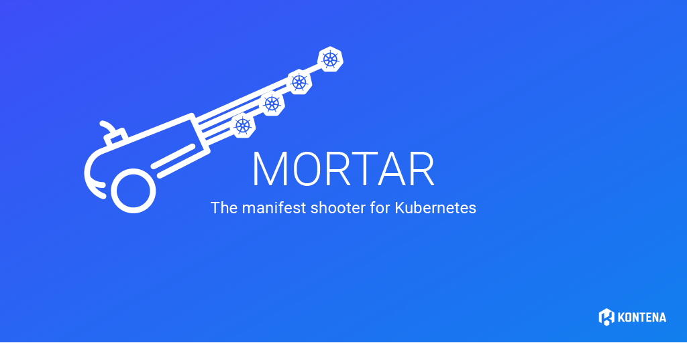

# Kontena Mortar



Mortar is a tool to easily handle a complex set of Kubernetes resources. Using `kubectl apply -f some_folder/` is pretty straightforward for simple cases, but often, especially in CI/CD pipelines things get complex. Then on the otherhand, writing everything in Helm charts is way too complex.

While we were developing [Kontena Pharos](https://kontena.io/pharos) Kubernetes distro and tooling around it, we soon realized that we really want to manage sets of resources as a single unit. This thinking got even stronger while we were transitioning many of our production solutions to run on top of Kubernetes. As this is a common problem for all Kubernetes users, Mortar was born.

## Features

- [Management of sets of resources as a single unit](#shots)
- [Simple templating](#templating)
- [Overlays](#overlays)

## Installation

Rubygems:

`$ gem install kontena-mortar`

Docker:

`$ docker pull quay.io/kontena/mortar:latest`

We will be working on also to support binary installation method in near future.

## Usage

### Configuration

By default mortar looks for if file `~/.kube/config` exists and uses it as the configuration. Configuration file path can be overridden with `KUBECONFIG` environment variable.

For CI/CD use mortar also understands following environment variables:

- `KUBE_SERVER`: kubernetes api server address, for example `https://10.10.10.10:6443`
- `KUBE_TOKEN`: service account token
- `KUBE_CA`: kubernetes CA certificate (base64 encoded)

### Deploying k8s yaml manifests

```
$ mortar [options] <deployment-name> <src-folder>
```

### Docker image

You can use mortar in CI/CD pipelines (like Drone) via `quay.io/kontena/mortar:latest` image.

Example config for Drone:

```yaml
pipeline:
  deploy:
    image: quay.io/kontena/mortar:latest
    secrets: [ kube_token, kube_ca, kube_server ]
    commands:
      - mortar my-app k8s/

```

## Shots

Mortar manages a set of resources as a single unit, we call them *shots*. A shot can have as many resources as your application needs, there's no limit to that. Much like you'd do with `kubectl apply -f my_dir/`, but Mortar actually injects information into the resources it shoots into your Kubernetes cluster. This added information, labels and annotations, will be used later on by Mortar itself or can be used with `kubectl` too. This allows the management of many resources as a single application.

Most importantly, Mortar is able to use this information when re-shooting your applications. One of the most diffucult parts when using plain `kubectl apply ...` approach is the fact that it's super easy to leave behind some lingering resources. Say you have some `deployments` and a `service` in your application, each defined in their own `yaml` file. Now you remove the service and re-apply with `kubectl apply -f my_resources/`. The service will live on in your cluster. With Mortar, you don't have to worry. With the extra labels and annotations Mortar injects into the resources, it's also able to automatically prune the "un-necessary" resources from the cluster. The automatic pruning is done with `--prune` option.

See basic example [here](/examples/basic).

## Overlays

One of the most powerful features of Mortar is it's ability to support *overlays*. An overlay is a variant of the set of resources you are managing. A variant might be for example the same application running on many different environments like production, test, QA an so on. A variant might also be a separate application "instance" for each customer. Or what ever the need is. Overlays in Mortar are inspired by [kustomize](https://github.com/kubernetes-sigs/kustomize).

Given a folder & file structure like:
```
echoservice-metallb/
├── echo-metal.yml
├── foo
│   └── pod.yml.erb
└── prod
    ├── pod.yml
    └── svc.yml
```

where overlays (`prod` & `foo`) contain same resources as the base folder, mortar now merges all resources together. Merging is done in the order overlays are given in the command. Resources are considered to be the same resource if all of these match: `kind`, `apiVersion`, `metadata.name` and `metadata.namespace`.

If there are new resources in the overlay dirs, they are taken into the shot as-is.

You'd select overlays taken into processing with `--overlay option`.

**Note:** Overlays are taken in in the order defined, so make sure you define them in correct order.

The resources in the overlays do not have to be complete, it's enough that the "identifying" fields are the same.

See example of overlays [here](/examples/overlays).

## Templating

Mortar also support templating for the resource definitons. The templating language used is [ERB](https://en.wikipedia.org/wiki/ERuby). It's pretty simple templating language but yet powerful enough for Kubernetes resource templating.

Mortar automatically processes the resource definition as a template if the filename is either `.yml.erb` or `.yaml.erb`.

There are two ways to introduce variables into the templating.

See examples at [examples/templates](examples/templates).

### Environment variables

As for any process, environment variables are also available for Mortar during template processing.

```
kind: Pod
apiVersion: v1
metadata:
  name: nginx
  labels:
    name: nginx
  namespace: default
spec:
  containers:
  - name: nginx
    image: nginx:<%= ENV["NGINX_VERSION"] || "latest" %>
    ports:
      - containerPort: 80
```

### Variables via options

Another option to use variables is via command-line options. Use `mortar --var foo=bar my-app resources/`.

Each of the variables defined will be available in the template via `var.<variable name>`.

```
kind: Pod
apiVersion: v1
metadata:
  name: nginx
  labels:
    name: nginx
  namespace: default
spec:
  containers:
  - name: nginx
    image: nginx:latest
    ports:
      - containerPort: <%= port.number %>
        name: <%= port.name %>
```

You could shoot this resource with `mortar --var port.name=some-port --var port.number=80 my-app resources/pod.yml.erb`


## Contributing

Bug reports and pull requests are welcome on GitHub at https://github.com/kontena/mortar.

## License

Copyright (c) 2018 Kontena, Inc.

Licensed under the Apache License, Version 2.0 (the "License"); you may not use this file except in compliance with the License. You may obtain a copy of the License at

http://www.apache.org/licenses/LICENSE-2.0

Unless required by applicable law or agreed to in writing, software distributed under the License is distributed on an "AS IS" BASIS, WITHOUT WARRANTIES OR CONDITIONS OF ANY KIND, either express or implied. See the License for the specific language governing permissions and limitations under the License.
